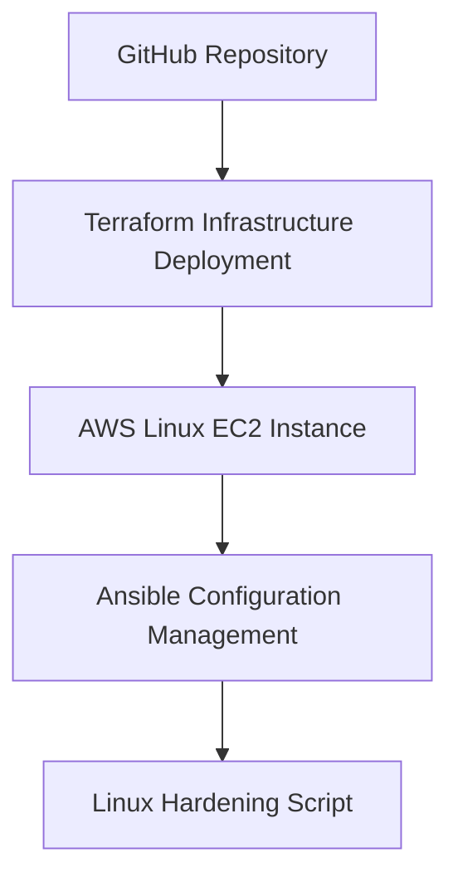

# Cloud Linux Automation Lab


This project demonstrates how to deploy and automate a secure Linux cloud environment using Infrastructure as Code and configuration management tools.

## Project Overview

The Cloud Linux Automation Lab simulates a real-world DevOps workflow where cloud infrastructure is provisioned, configured, and hardened using automated tools.

This lab includes:

• Terraform for infrastructure provisioning  
• Ansible for server configuration  
• Bash scripting for Linux security hardening  

The goal of this project is to demonstrate practical DevOps and Cloud Engineering skills.

---

## Technology Stack

Terraform<p>
Terraform Variables<p>
Ansible<p>
Linux<p>
Bash<p>
AWS<p>

---

## Project Structure

```
cloud-linux-automation-lab
│
├── terraform
│   └── main.tf
│
├── ansible
│   └── playbook.yml
│
├── scripts
│   └── linux-hardening.sh
│
└── README.md
```

---

## Architecture Diagram



## Infrastructure Deployment

Terraform is used to provision a Linux EC2 instance in AWS.

Example command:

```
terraform init
terraform apply
```

---

## Configuration Management

Ansible is used to configure the Linux server after deployment.

Example command:

```
ansible-playbook playbook.yml
```

---

## Linux Security Hardening

The project includes a hardening script that:

• Updates system packages  
• Installs firewall protection  
• Enables security services  

Example:

```
bash scripts/linux-hardening.sh
```

---

## Future Improvements

Docker container deployment
Infrastructure monitoring integration
CI/CD pipeline automation
Automated security scanning

---

## Architecture Documentation

For a detailed explanation of the infrastructure workflow and deployment process, see:

[Architecture Overview](architecture.md)

## Author

Ta'Nara N. Taylor  
Cloud Engineer | Linux Infrastructure | Security Automation
